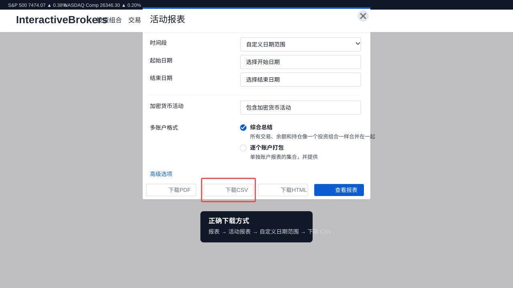

# IBKR Trade History Visualizer

<p align="center">
  <a href="https://ibkr-trade-visualizer.vercel.app/"><strong>Launch App</strong></a>
  ·
  <a href="#中文">中文</a>
  ·
  <a href="#english">English</a>
</p>

<p align="center">
  <a href="https://ibkr-trade-visualizer.vercel.app/">https://ibkr-trade-visualizer.vercel.app/</a>
</p>

---

## 中文

这是一个纯前端的交易历史可视化工具。你可以直接访问线上版本使用，不需要安装：

[打开在线应用](https://ibkr-trade-visualizer.vercel.app/)

所有 CSV 解析、收益计算、图表展示和本地保存都发生在你的浏览器里。项目没有后端服务，也不会把你的交易数据上传到服务器。

### 功能

- 导入 Interactive Brokers 活动报表 CSV
- 导入 TradingView / 标准成交 CSV
- 按账户隔离不同交易数据
- 自动去重，避免重复导入同一批成交
- 展示净值曲线、每日盈亏柱状图、日历视图和交易明细
- 统计胜率、盈亏因子、平均盈亏比、最大回撤、平均持仓时间、最大连胜/连败

### 推荐的 IBKR 报表下载方式

如果你使用 Interactive Brokers，请下载 **活动报表 / Activity Statement** 的 CSV。不要使用 PDF、HTML、Excel，也不要只导出现金流水。



在 IBKR 网页端按下面步骤下载：

1. 进入 **报表** 页面
2. 选择 **活动报表**
3. 时间段选择 **自定义日期范围**
4. 选择起始日期和结束日期
5. 多账户格式选择 **综合总结**
6. 点击底部的 **下载 CSV**

导入时选择：

```text
IBKR Transaction History (Report)
```

### 标准 CSV 模板

如果你不是 IBKR 用户，或者你的券商只能导出普通成交记录，可以使用标准模板：

[下载标准成交 CSV 模板](./docs/templates/standard-trades-template.csv)

模板说明：

[查看模板字段说明](./docs/templates/README.md)

标准模板需要包含这些列：

```csv
Symbol,Side,Qty,Fill Price,Time,Commission,Net Amount
```

其中 `Side` 必须是 `Buy` 或 `Sell`，`Time` 推荐使用 `YYYY-MM-DD HH:mm:ss`。

### 收益口径

对于 IBKR 活动报表，本项目会读取 CSV 里的 `交易 / Trades` 明细段，把期货成交作为原始 Buy/Sell 执行流水导入，并使用 FIFO 复原已平仓交易。

因此交易明细可以展示：

- 开仓价
- 平仓价
- 点数
- 开仓时间
- 平仓时间
- 持仓时间
- 手续费
- 每笔净盈亏

不会计入交易收益的项目：

- 利息
- 入金
- 出金
- 转账
- 现金报告
- 应计利息变化

注意：如果报表期初已经有持仓，而开仓成交发生在报表开始日期之前，应用无法凭空知道那笔期初仓位的真实成本。遇到这种没有开仓腿的平仓记录，系统会跳过无法复原的部分，避免制造假的开仓价。为了获得最完整的复盘结果，请尽量导入覆盖完整开仓和平仓周期的活动报表。

### 本地运行

```bash
npm install
npm run dev
```

然后打开：

```text
http://127.0.0.1:5173/
```

---

## English

This is a client-side trade history visualizer. You can use the hosted app directly without installing anything:

[Open the live app](https://ibkr-trade-visualizer.vercel.app/)

CSV parsing, PnL calculation, chart rendering, and storage all happen locally in your browser. There is no backend service, and your trade data is not uploaded to a server.

### Features

- Import Interactive Brokers Activity Statement CSV files
- Import TradingView / standard execution CSV files
- Keep multiple accounts or strategies isolated
- Deduplicate repeated imports
- Visualize equity curve, daily PnL bars, calendar view, and trade logs
- Track win rate, profit factor, average reward/risk, max drawdown, hold time, and streaks

### Recommended IBKR Report

For Interactive Brokers, download the **Activity Statement** as CSV. Do not use PDF, HTML, Excel, or a cash-only transaction export.


Download path in the IBKR web portal:

1. Go to **Reports**
2. Choose **Activity Statement**
3. Set the period to **Custom Date Range**
4. Select your start date and end date
5. Set multi-account format to **Consolidated**
6. Click **Download CSV**

When importing, choose:

```text
IBKR Transaction History (Report)
```

### Standard CSV Template

If you are not using IBKR, or if your broker only provides generic execution records, use the standard template:

[Download the standard trade CSV template](./docs/templates/standard-trades-template.csv)

Template documentation:

[View template field guide](./docs/templates/README.md)

The standard template must include:

```csv
Symbol,Side,Qty,Fill Price,Time,Commission,Net Amount
```

`Side` must be `Buy` or `Sell`. `Time` should preferably use `YYYY-MM-DD HH:mm:ss`.

### PnL Methodology

For IBKR Activity Statement files, this project reads the `Trades` section, imports futures executions as raw Buy/Sell fills, and reconstructs closed trades with FIFO.

Trade logs can therefore show:

- Entry price
- Exit price
- Points
- Entry time
- Exit time
- Hold time
- Commission
- Net PnL

The trading PnL does not include:

- Interest
- Deposits
- Withdrawals
- Transfers
- Cash reports
- Accrued interest changes

Important: if your report starts with positions that were already open before the report start date, the app cannot infer the original cost basis for those starting positions. Close-only records without an opening leg are skipped instead of inventing fake entries. For the most complete review, import a date range that covers both opening and closing executions.

### Run Locally

```bash
npm install
npm run dev
```

Then open:

```text
http://127.0.0.1:5173/
```

## Development

Useful source files:

- [`src/App.tsx`](./src/App.tsx)
- [`src/adapters/ibkrAdapter.ts`](./src/adapters/ibkrAdapter.ts)
- [`src/adapters/tradingViewAdapter.ts`](./src/adapters/tradingViewAdapter.ts)
- [`src/utils/tradeLogic.ts`](./src/utils/tradeLogic.ts)
- [`src/utils/statistics.ts`](./src/utils/statistics.ts)

## License

MIT
